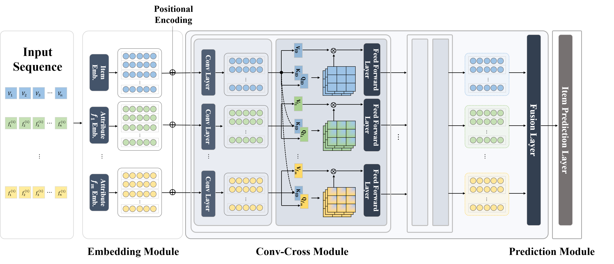

## Overview
Session-based recommendation (SR) systems aim to capture the sequential patterns of user-item interactions within a session to predict the next items. While recent SR research primarily focuses on analyzing the sequences of items users interact with, this approach often fails to fully reflect users' interests. In this paper, we aim to better learn the sequences of items by effectively considering the side information of items, such as the categories or brands of items. To achieve this, we propose a novel method for SR based on the cross-attention mechanism. The cross-attention mechanism allows us to learn a better representation of a session by mutually considering the sequence of items and the sequences of their side information. Through the cross-attention mechanism, the proposed method can better learn the sequences of items by reflecting the side information of the items, facilitating more precise predictions of sequences. Furthermore, we add a convolutional layer before the cross-attention layer to remove noise in a session, such as accidental clicks, and better recognize sequential patterns. This convolutional layer minimizes distortion caused by meaningless user-item interactions within the session, thus improving the recommendation system's accuracy and efficiency. 



## Preparation

Our code is based on PyTorch 1.8.1 and runnable for both windows and ubuntu server. Required python packages:

> + numpy==1.26.2
> + scipy==1.9.0
> + torch==1.12.1
> + tensorboard==2.11.0


## Usage

Download datasets from [RecSysDatasets](https://github.com/RUCAIBox/RecSysDatasets) or their [Google Drive](https://drive.google.com/drive/folders/1ahiLmzU7cGRPXf5qGMqtAChte2eYp9gI). And put the files in `./dataset/` like the following.

```
$ tree
.
├── Amazon_Beauty
│   ├── Amazon_Beauty.inter
│   └── Amazon_Beauty.item
└── yelp
    ├── README.md
    ├── yelp.inter
    ├── yelp.item
    └── yelp.user

```

Run `Conv_XA.sh`.


